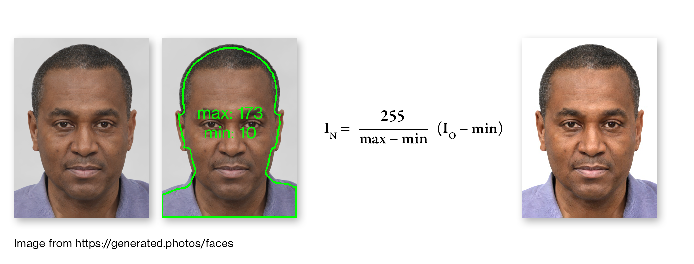

## Headshot-AutoClean

Performs automatic histogram normalisation on headshot portrait images. First the maximum and minimum pixel values within the subject region of the image are determined, then all pixel values are scaled such that the subject region maximum and minimum become the maximum and minimum for the whole image. This improves the appearance of images which lack contrast, whilst also serving to brighten underlit backdrops.

The watershed algorithm is used for seqmenting subject from background and has been sufficiently accurate for this application.

